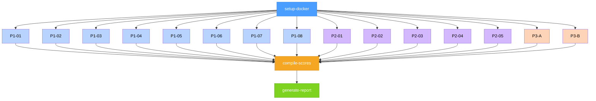

# Groktobench Kanban Board Definition

> **Project**: Groktobench — benchmark for evaluating Hermes agent skill fidelity in clean Docker environments
> **Status**: Reference document for board structure, task graph, and orchestration workflow
> **Board model**: Standard Hermes flat-board with parent/child task dependencies (NOT SkillOpt lanes)

---

## 1. Board Slug Naming Convention

Every Groktobench run creates a unique kanban board. The slug follows a deterministic pattern:

```
groktobench-<unix-timestamp>
```

**Examples**:

| Timestamp       | Board Slug                           |
|-----------------|--------------------------------------|
| 1717000000      | `groktobench-1717000000`             |
| 1717100000      | `groktobench-1717100000`             |
| 1717200000      | `groktobench-1717200000`             |

The slug is generated at board creation time by the orchestrator using `date +%s` and embedded in the board metadata for traceability. This guarantees uniqueness across runs and provides a chronological sort key.

---

## 2. Task Dependency Graph

### 2.1 ASCII DAG

```
                            ┌─────────────────────────────┐
                            │       setup-docker           │
                            │  (no dependencies — root)    │
                            └─────────────┬───────────────┘
                                          │
                                          ▼
                          ┌────────────────────────────────┐
                          │     PHASE 1 — Recognition      │
                          │    (8 parallel probe tasks)    │
                          │                                │
         ┌─────┬─────┬─────┬─────┬─────┬─────┬─────┬─────┐
         │     │     │     │     │     │     │     │     │
         ▼     ▼     ▼     ▼     ▼     ▼     ▼     ▼     │
       P1-01 P1-02 P1-03 P1-04 P1-05 P1-06 P1-07 P1-08  │
         │     │     │     │     │     │     │     │     │
         └─────┴─────┴─────┴─────┴─────┴─────┴─────┴─────┘
                          │
                          ▼
                          │
                          ▼
                          │
                          ▼
              ┌──────────────────────────────┐
              │    PHASE 2 — Fidelity        │
              │   (5 parallel probe tasks)   │
              │                              │
         ┌─────┬─────┬─────┬─────┬────┐      │
         │     │     │     │     │    │      │
         ▼     ▼     ▼     ▼     ▼    │      │
       P2-01 P2-02 P2-03 P2-04 P2-05 │      │
         │     │     │     │     │    │      │
         └─────┴─────┴─────┴─────┴────┘      │
              │                              │
              ▼                              │
              │                              │
              ▼                              │
              │                              │
              ▼                              │
              └──────────────────────────────┘
                          │
                          ▼
              ┌──────────────────────────────┐
              │    PHASE 3 — Chaining        │
              │   (2 parallel probe tasks)   │
              │                              │
                ┌──────┐ ┌──────┐            │
                │      │ │      │            │
                ▼      │ ▼      │            │
              P3-A    P3-B      │            │
                │      │ │      │            │
                └──────┘ └──────┘            │
              │                              │
              └──────────────┬───────────────┘
                             │
                             ▼
              ┌──────────────────────────────┐
              │       compile-scores         │
              │  (depends on ALL 15 probes)  │
              └──────────────┬───────────────┘
                             │
                             ▼
              ┌──────────────────────────────┐
              │       generate-report        │
              │  (depends on compile-scores) │
              └──────────────────────────────┘
```

### 2.2 Dependency Summary

| Task ID          | Depends On                    | Blocking                        |
|------------------|-------------------------------|----------------------------------|
| setup-docker     | (none — root task)            | All probe tasks (15)             |
| P1-01 — P1-08   | setup-docker                  | compile-scores                   |
| P2-01 — P2-05   | setup-docker                  | compile-scores                   |
| P3-A, P3-B      | setup-docker                  | compile-scores                   |
| compile-scores   | P1-01..08, P2-01..05, P3-A,B | generate-report                  |
| generate-report  | compile-scores                | (none — terminal task)           |

### 2.3 Mermaid Diagram



---

## 3. Task Definitions

### 3.1 Setup Task — `setup-docker`

| Property       | Value                                          |
|----------------|------------------------------------------------|
| **ID**         | `setup-docker`                                 |
| **Title**      | Setup Hermes Docker Environment                |
| **Type**       | `setup`                                        |
| **Deps**       | (none)                                         |
| **Workspace**  | `benchmark-orchestrator`                       |
| **Status**     | `backlog` → `in-progress` → `done`             |
| **Description**| Build or pull the clean Hermes Docker image, verify the container starts, and confirm `hermes -z` responds. No probes run until this completes. |
| **Output**     | Docker image ID, container health check log    |

**Acceptance criteria**:
1. `docker build -t hermes-bench .` succeeds with exit code 0
2. `docker run hermes-bench hermes -z` returns a valid response within 30 s
3. Clean-room config (`config.yaml`) is loaded — no custom skills, no plugins
4. Session export directory is writable inside the container

### 3.2 Probe Tasks — Phase 1: Recognition (P1-01 through P1-08)

| Property       | Value                                          |
|----------------|------------------------------------------------|
| **ID prefix**  | `P1-` (01–08)                                  |
| **Title**      | `<probe-name>` (e.g. P1-01: skill-recognition-filesystem) |
| **Type**       | `probe`                                        |
| **Phase**      | 1 (recognition)                                |
| **Deps**       | `setup-docker`                                 |
| **Workspace**  | `benchmark-phase1`                             |
| **Status**     | `backlog` → `in-progress` → `review` → `done` |
| **Description**| Run a single phase-1 probe against the Hermes Docker instance. These probes test whether the model loads the correct skill and follows the expected tool call pattern for a given prompt. |
| **Input**      | Probe definition file from `probes/phase1-recognition/` |
| **Output**     | Session export JSON → scored result JSON       |

**Probes**:
| ID    | Probe File                       | Skill Expected                |
|-------|----------------------------------|-------------------------------|
| P1-01 | `skill-recognition-filesystem.md`| `filesystem`                  |
| P1-02 | `skill-recognition-shell.md`     | `shell`                       |
| P1-03 | `skill-recognition-web.md`       | `web`                         |
| P1-04 | `skill-recognition-code.md`      | `code`                        |
| P1-05 | `skill-recognition-search.md`    | `search`                      |
| P1-06 | `skill-recognition-writing.md`   | `writing`                     |
| P1-07 | `skill-recognition-planning.md`  | `planning`                    |
| P1-08 | `skill-recognition-memory.md`    | `memory`                      |

### 3.3 Probe Tasks — Phase 2: Fidelity (P2-01 through P2-05)

| Property       | Value                                          |
|----------------|------------------------------------------------|
| **ID prefix**  | `P2-` (01–05)                                  |
| **Title**      | `<probe-name>` (e.g. P2-01: skill-fidelity-filesystem-deep) |
| **Type**       | `probe`                                        |
| **Phase**      | 2 (fidelity)                                   |
| **Deps**       | `setup-docker`                                 |
| **Workspace**  | `benchmark-phase2`                             |
| **Status**     | `backlog` → `in-progress` → `review` → `done` |
| **Description**| Run a single phase-2 probe against the Hermes Docker instance. These probes go deeper — they test whether the model correctly composes skill functionality, handles edge cases, and produces expected side effects in the Docker environment. |
| **Input**      | Probe definition file from `probes/phase2-fidelity/` |
| **Output**     | Session export JSON → scored result JSON       |

**Probes**:
| ID    | Probe File                          | Fidelity Axis               |
|-------|-------------------------------------|------------------------------|
| P2-01 | `skill-fidelity-filesystem-deep.md` | Filesystem depth & edge cases|
| P2-02 | `skill-fidelity-shell-pipeline.md`  | Shell pipeline composition   |
| P2-03 | `skill-fidelity-web-extraction.md`  | Web content extraction       |
| P2-04 | `skill-fidelity-code-multi-step.md` | Multi-step code generation   |
| P2-05 | `skill-fidelity-search-precision.md`| Search precision & filtering |

### 3.4 Probe Tasks — Phase 3: Chaining (P3-A, P3-B)

| Property       | Value                                          |
|----------------|------------------------------------------------|
| **ID**         | `P3-A`, `P3-B`                                 |
| **Title**      | `skill-chaining-<axis>`                        |
| **Type**       | `probe`                                        |
| **Phase**      | 3 (chaining)                                   |
| **Deps**       | `setup-docker`                                 |
| **Workspace**  | `benchmark-phase3`                             |
| **Status**     | `backlog` → `in-progress` → `review` → `done` |
| **Description**| Run a phase-3 chaining probe. These probes test cross-skill orchestration — the model must use multiple Hermes skills in sequence to accomplish a multi-step task. Phase 3 also includes self-consistency scoring where the model judges its own output. |
| **Input**      | Probe definition file from `probes/phase3-chaining/` |
| **Output**     | Session export JSON → scored result JSON (including self-consistency score) |

**Probes**:
| ID    | Probe File                   | Chaining Pattern              |
|-------|------------------------------|-------------------------------|
| P3-A  | `skill-chaining-filesystem-search-code.md` | Filesystem → Search → Code    |
| P3-B  | `skill-chaining-web-code-report.md`       | Web → Code → Report generation|

### 3.5 Compile Task — `compile-scores`

| Property       | Value                                          |
|----------------|------------------------------------------------|
| **ID**         | `compile-scores`                                |
| **Title**      | Compile All Probe Scores                        |
| **Type**       | `compile`                                      |
| **Deps**       | ALL 15 probe tasks (P1-01..08, P2-01..05, P3-A, P3-B) |
| **Workspace**  | `benchmark-orchestrator`                       |
| **Status**     | `backlog` → `in-progress` → `done`             |
| **Description**| Aggregate scored result JSONs from all 15 probes into a single compiled score manifest. This task blocks until every probe task reaches `done` status. |
| **Output**     | `compiled-scores.json` — merged score manifest  |

**Score manifest structure**:
```json
{
  "board_slug": "groktobench-1717000000",
  "run_timestamp": 1717000000,
  "phases": {
    "phase1": { "recognition": { "total": 8, "pass": 0, "fail": 0, "score_pct": 0.0 } },
    "phase2": { "fidelity": { "total": 5, "pass": 0, "fail": 0, "score_pct": 0.0 } },
    "phase3": { "chaining": { "total": 2, "pass": 0, "fail": 0, "score_pct": 0.0 } }
  },
  "overall": { "total_probes": 15, "pass": 0, "fail": 0, "score_pct": 0.0 },
  "probe_results": []
}
```

### 3.6 Report Task — `generate-report`

| Property       | Value                                          |
|----------------|------------------------------------------------|
| **ID**         | `generate-report`                               |
| **Title**      | Generate Benchmark Report                       |
| **Type**       | `report`                                       |
| **Deps**       | `compile-scores`                                |
| **Workspace**  | `benchmark-orchestrator`                       |
| **Status**     | `backlog` → `in-progress` → `done`             |
| **Description**| Transform the compiled score manifest into a human-readable diagnostic report. Generates markdown, HTML, and optionally JSON output. This is the terminal task of the benchmark run. |
| **Output**     | `report.md`, `report.html`, `report.json`      |

---

## 4. Workspace Layout

The board uses three workspaces to organize tasks by function:

| Workspace                | Color    | Tasks                                  |
|--------------------------|----------|----------------------------------------|
| `benchmark-orchestrator` | Blue     | setup-docker, compile-scores, generate-report |
| `benchmark-phase1`       | Light    | P1-01 through P1-08                   |
| `benchmark-phase2`       | Purple   | P2-01 through P2-05                   |
| `benchmark-phase3`       | Orange   | P3-A, P3-B                            |

---

## 5. Board Creation Commands

### 5.1 Create the Board

```bash
TS=$(date +%s)
BOARD_SLUG="groktobench-${TS}"

# Create the flat kanban board
hermes kanban boards create \
  --slug "${BOARD_SLUG}" \
  --title "Groktobench Run ${TS}" \
  --description "Benchmark run for Hermes agent skill evaluation (synthetic data, clean Docker environment)" \
  --workspace "benchmark-orchestrator" \
  --workspace "benchmark-phase1" \
  --workspace "benchmark-phase2" \
  --workspace "benchmark-phase3"
```

### 5.2 Create Root Task — `setup-docker`

```bash
hermes kanban create \
  --board "${BOARD_SLUG}" \
  --title "Setup Hermes Docker Environment" \
  --id "setup-docker" \
  --type "setup" \
  --workspace "benchmark-orchestrator" \
  --description "Build/pull clean Hermes Docker image and verify container health"
```

### 5.3 Create Phase 1 Probe Tasks (child of setup-docker)

```bash
for id in P1-01 P1-02 P1-03 P1-04 P1-05 P1-06 P1-07 P1-08; do
  hermes kanban create \
    --board "${BOARD_SLUG}" \
    --title "Phase 1 Recognition Probe: ${id}" \
    --id "${id}" \
    --type "probe" \
    --phase "1" \
    --workspace "benchmark-phase1" \
    --parent "setup-docker" \
    --description "Run probe ${id} against the Hermes Docker container"
done
```

### 5.4 Create Phase 2 Probe Tasks (child of setup-docker)

```bash
for id in P2-01 P2-02 P2-03 P2-04 P2-05; do
  hermes kanban create \
    --board "${BOARD_SLUG}" \
    --title "Phase 2 Fidelity Probe: ${id}" \
    --id "${id}" \
    --type "probe" \
    --phase "2" \
    --workspace "benchmark-phase2" \
    --parent "setup-docker" \
    --description "Run probe ${id} against the Hermes Docker container"
done
```

### 5.5 Create Phase 3 Probe Tasks (child of setup-docker)

```bash
for id in P3-A P3-B; do
  hermes kanban create \
    --board "${BOARD_SLUG}" \
    --title "Phase 3 Chaining Probe: ${id}" \
    --id "${id}" \
    --type "probe" \
    --phase "3" \
    --workspace "benchmark-phase3" \
    --parent "setup-docker" \
    --description "Run probe ${id} against the Hermes Docker container"
done
```

### 5.6 Create `compile-scores` (parent of all 15 probes)

```bash
hermes kanban create \
  --board "${BOARD_SLUG}" \
  --title "Compile All Probe Scores" \
  --id "compile-scores" \
  --type "compile" \
  --workspace "benchmark-orchestrator" \
  --parent "P1-01" "P1-02" "P1-03" "P1-04" "P1-05" "P1-06" "P1-07" "P1-08" \
  --parent "P2-01" "P2-02" "P2-03" "P2-04" "P2-05" \
  --parent "P3-A" "P3-B" \
  --description "Aggregate all 15 probe score results into a compiled score manifest"
```

### 5.7 Create `generate-report` (child of compile-scores)

```bash
hermes kanban create \
  --board "${BOARD_SLUG}" \
  --title "Generate Benchmark Report" \
  --id "generate-report" \
  --type "report" \
  --workspace "benchmark-orchestrator" \
  --parent "compile-scores" \
  --description "Generate human-readable diagnostic report from compiled scores"
```

### 5.8 Automated Board Bootstrap Script

A single script that creates the entire board in one invocation:

```bash
#!/usr/bin/env bash
set -euo pipefail

TS=$(date +%s)
BOARD_SLUG="groktobench-${TS}"

echo "=== Creating board: ${BOARD_SLUG} ==="

hermes kanban boards create \
  --slug "${BOARD_SLUG}" \
  --title "Groktobench Run ${TS}" \
  --description "Hermes agent skill benchmark run ${TS}" \
  --workspace "benchmark-orchestrator" \
  --workspace "benchmark-phase1" \
  --workspace "benchmark-phase2" \
  --workspace "benchmark-phase3"

# ── Root task ──────────────────────────────────────
hermes kanban create \
  --board "${BOARD_SLUG}" \
  --title "Setup Hermes Docker Environment" \
  --id "setup-docker" \
  --type "setup" \
  --workspace "benchmark-orchestrator"

# ── Phase 1 probes ─────────────────────────────────
for id in P1-01 P1-02 P1-03 P1-04 P1-05 P1-06 P1-07 P1-08; do
  hermes kanban create \
    --board "${BOARD_SLUG}" \
    --title "Phase 1 Recognition: ${id}" \
    --id "${id}" \
    --type "probe" \
    --phase 1 \
    --workspace "benchmark-phase1" \
    --parent "setup-docker"
done

# ── Phase 2 probes ─────────────────────────────────
for id in P2-01 P2-02 P2-03 P2-04 P2-05; do
  hermes kanban create \
    --board "${BOARD_SLUG}" \
    --title "Phase 2 Fidelity: ${id}" \
    --id "${id}" \
    --type "probe" \
    --phase 2 \
    --workspace "benchmark-phase2" \
    --parent "setup-docker"
done

# ── Phase 3 probes ─────────────────────────────────
for id in P3-A P3-B; do
  hermes kanban create \
    --board "${BOARD_SLUG}" \
    --title "Phase 3 Chaining: ${id}" \
    --id "${id}" \
    --type "probe" \
    --phase 3 \
    --workspace "benchmark-phase3" \
    --parent "setup-docker"
done

# ── Compile scores (depends on all 15 probes) ─────
hermes kanban create \
  --board "${BOARD_SLUG}" \
  --title "Compile All Probe Scores" \
  --id "compile-scores" \
  --type "compile" \
  --workspace "benchmark-orchestrator" \
  --parent "P1-01" "P1-02" "P1-03" "P1-04" "P1-05" "P1-06" "P1-07" "P1-08" \
  --parent "P2-01" "P2-02" "P2-03" "P2-04" "P2-05" \
  --parent "P3-A" "P3-B"

# ── Generate report (terminal task) ────────────────
hermes kanban create \
  --board "${BOARD_SLUG}" \
  --title "Generate Benchmark Report" \
  --id "generate-report" \
  --type "report" \
  --workspace "benchmark-orchestrator" \
  --parent "compile-scores"

echo "=== Board ${BOARD_SLUG} created successfully ==="
```

---

## 6. Dispatch Instructions — Orchestrator-to-Worker Assignment

### 6.1 Orchestrator Role

The **orchestrator** (a Hermes agent running in the host environment) is responsible for:

1. Board creation (as described in §5)
2. Task dispatch — iterating through the board, identifying runnable tasks, and assigning them to worker agents
3. Status tracking — promoting tasks through the status flow (§7)
4. Compiling results once all probe tasks are done
5. Generating the final report

### 6.2 Worker Role

**Workers** are one-shot Hermes agents spawned inside the Docker container. Each worker:

1. Receives a single probe definition file as input
2. Starts `hermes -z` with that probe's prompt
3. Captures the session export (tool call transcript)
4. Runs the scoring script against the session export
5. Writes the scored result JSON back to the shared volume
6. Reports completion by promoting the task to `done`

### 6.3 Dispatch Algorithm

```
1.  LOAD board → get all tasks
2.  FILTER tasks where status = "backlog"
3.  For each backlog task:
    a. CHECK all parent tasks are "done"
    b. IF yes → dispatch to worker
4.  DISPATCH logic:
    - setup-docker:     orchestrator itself (not a worker)
    - probe tasks:      spawn docker worker, pass probe file
    - compile-scores:   orchestrator itself (aggregate JSON files)
    - generate-report:  orchestrator itself (transform JSON → report)
5.  On worker completion:
    a. Verify scored result JSON exists on shared volume
    b. Promote task status: in-progress → done
    c. Re-check dispatch (triggers dependents)
```

### 6.4 Worker Command Template

```bash
# Worker invocation for a single probe
docker run --rm \
  -v /var/run/docker.sock:/var/run/docker.sock \
  -v /tmp/bench-results:/results \
  hermes-bench \
  /bin/bash -c "
    probe_file='/probes/${PROBE_PATH}'
    prompt=\$(head -1 \"\$probe_file\" | sed 's/^prompt: //')
    echo \"Running probe: \$probe_file\"
    hermes -z \"\$prompt\" --export-session /results/session-\${PROBE_ID}.json
    python3 /scripts/score-probe.py \\
      --probe \"\$probe_file\" \\
      --session /results/session-\${PROBE_ID}.json \\
      --output /results/score-\${PROBE_ID}.json
  "
```

### 6.5 Concurrency Model

| Task Type    | Max Parallel | Rationale                                   |
|--------------|-------------|---------------------------------------------|
| setup-docker | 1           | Only one Docker build needed                |
| Phase 1      | 8           | Independent probes, no shared state         |
| Phase 2      | 5           | Independent probes, no shared state         |
| Phase 3      | 2           | Independent probes, no shared state         |
| compile      | 1           | Sequential — reads all score files          |
| report       | 1           | Sequential — depends on compile             |

All 15 probe tasks can run in parallel across phases since they share no cross-dependencies. The only limit is Docker host resources (CPU/memory).

---

## 7. Status Management — Task Promotion Flow

### 7.1 Status Chain

Every task on the board follows a linear promotion path:

```
backlog → in-progress → [review] → done
```

- **setup-docker**, **compile-scores**, **generate-report** use the 3-state chain: `backlog → in-progress → done` (no review gate)
- **probe tasks** use the 4-state chain: `backlog → in-progress → review → done` (review gate for score verification)

### 7.2 Status Promotion Rules

| Transition          | Trigger                        | By                 |
|---------------------|--------------------------------|--------------------|
| backlog→in-progress | Parents all "done" + worker available | Orchestrator |
| in-progress→review  | Worker writes result JSON and signals completion | Worker agent |
| review→done         | Score result verified (JSON valid, all fields present) | Orchestrator |
| in-progress→done    | (for setup/compile/report) Task script exits with code 0 | Orchestrator |

### 7.3 Status Promotion Commands

```bash
# Promote a single task
hermes kanban update "${BOARD_SLUG}" --task "P1-01" --status "in-progress"
hermes kanban update "${BOARD_SLUG}" --task "P1-01" --status "review"
hermes kanban update "${BOARD_SLUG}" --task "P1-01" --status "done"

# Bulk promote all done probes to review (sanity check)
hermes kanban update "${BOARD_SLUG}" \
  --task "P1-01" "P1-02" "P1-03" "P1-04" \
  --status "done"
```

### 7.4 Example Run Timeline

```
T+00s  ── create board, create all tasks (all "backlog")
T+01s  ── promote setup-docker → in-progress
T+05s  ── promote setup-docker → done
         ── promote P1-01..08, P2-01..05, P3-A/B → in-progress (simultaneously)
T+15s  ── P1-01 → review, P2-03 → review  (first completions)
T+30s  ── all 15 probes → review
T+32s  ── all 15 probes → done (verified)
         ── compile-scores → in-progress
T+33s  ── compile-scores → done
         ── generate-report → in-progress
T+35s  ── generate-report → done
         ── RUN COMPLETE
```

### 7.5 Error / Retry Flow

If a probe task fails (scoring script returns non-zero, session export missing, score JSON invalid):

```
in-progress → failed → backlog
```

The orchestrator resets the task to `backlog` with an incremented `retry_count`. After 3 retries, the task is marked `blocked` and flagged for manual review.

```bash
# Retry a failed probe
hermes kanban update "${BOARD_SLUG}" --task "P1-04" --status "backlog" --note "Retry #2: session export was empty"

# Escalate after max retries
hermes kanban update "${BOARD_SLUG}" --task "P1-04" --status "blocked" --note "Max retries exceeded — manual review required"
```

---

## Appendix A: Complete Task Inventory

| #  | ID              | Title                                | Type    | Phase | Workspace                | Deps                |
|----|-----------------|--------------------------------------|---------|-------|--------------------------|---------------------|
| 1  | setup-docker    | Setup Hermes Docker Environment      | setup   | —     | benchmark-orchestrator   | (none)              |
| 2  | P1-01           | Phase 1: skill-recognition-filesystem| probe   | 1     | benchmark-phase1         | setup-docker        |
| 3  | P1-02           | Phase 1: skill-recognition-shell     | probe   | 1     | benchmark-phase1         | setup-docker        |
| 4  | P1-03           | Phase 1: skill-recognition-web       | probe   | 1     | benchmark-phase1         | setup-docker        |
| 5  | P1-04           | Phase 1: skill-recognition-code      | probe   | 1     | benchmark-phase1         | setup-docker        |
| 6  | P1-05           | Phase 1: skill-recognition-search    | probe   | 1     | benchmark-phase1         | setup-docker        |
| 7  | P1-06           | Phase 1: skill-recognition-writing   | probe   | 1     | benchmark-phase1         | setup-docker        |
| 8  | P1-07           | Phase 1: skill-recognition-planning  | probe   | 1     | benchmark-phase1         | setup-docker        |
| 9  | P1-08           | Phase 1: skill-recognition-memory    | probe   | 1     | benchmark-phase1         | setup-docker        |
| 10 | P2-01           | Phase 2: skill-fidelity-filesystem   | probe   | 2     | benchmark-phase2         | setup-docker        |
| 11 | P2-02           | Phase 2: skill-fidelity-shell        | probe   | 2     | benchmark-phase2         | setup-docker        |
| 12 | P2-03           | Phase 2: skill-fidelity-web          | probe   | 2     | benchmark-phase2         | setup-docker        |
| 13 | P2-04           | Phase 2: skill-fidelity-code         | probe   | 2     | benchmark-phase2         | setup-docker        |
| 14 | P2-05           | Phase 2: skill-fidelity-search       | probe   | 2     | benchmark-phase2         | setup-docker        |
| 15 | P3-A            | Phase 3: skill-chaining-fs-search-cd | probe   | 3     | benchmark-phase3         | setup-docker        |
| 16 | P3-B            | Phase 3: skill-chaining-web-code-rpt | probe   | 3     | benchmark-phase3         | setup-docker        |
| 17 | compile-scores  | Compile All Probe Scores             | compile | —     | benchmark-orchestrator   | All 15 probes       |
| 18 | generate-report | Generate Benchmark Report            | report  | —     | benchmark-orchestrator   | compile-scores      |

**Total**: 18 tasks (1 setup + 15 probes + 1 compile + 1 report)

---

## Appendix B: Hermes Kanban Model Reference

This board uses the **standard Hermes flat-board model** (NOT SkillOpt lanes):

- **Flat board**: A single board level with tasks organized into workspaces (columns)
- **Parent/child deps**: Task A → Task B means "B depends on A" — B cannot start until A is `done`
- **Workspaces**: Logical groupings (columns) on the board; tasks can be filtered by workspace
- **Statuses**: Per-task, linear promotion (`backlog → in-progress → review → done`)
- **Slugs**: Unique board identifiers, used in all `hermes kanban` commands
